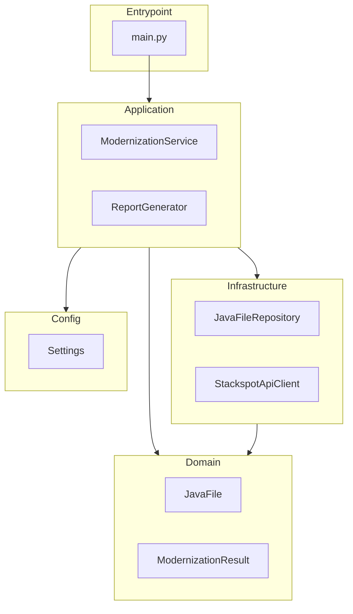

## Índice

1. [📟 Principais tecnologias utilizadas](#📟-principais-tecnologias-utilizadas)
2. [💿 Instalação e Execução](#💿-instalação-e-execução)
3. [🌎 Visão Geral](#🌎-visão-geral)
4. [💵 Principais Regras de Negócio](#💵-principais-regras-de-negócio)
5. [📐 Arquitetura e Design](#📐-arquitetura-e-design)
6. [🚀 API - Endpoints HTTP](#🚀-api---endpoints-http)
    - [📡 Endpoints Expostos pela Aplicação](#📡-endpoints-expostos-pela-aplicação)
    - [📡 cURL dos Endpoints](#📡-curl-dos-endpoints)
    - [📟 Endpoints Consumidos pela Aplicação](#📟-endpoints-consumidos-pela-aplicação)
7. [✉️ Comunicação Assíncrona (Mensageria)](#✉️-comunicação-assíncrona-(mensageria))
    - [👂 Consumers](#👂-consumers)
    - [📣 Producers](#📣-producers)
8. [🎲 Modelo de Dados da Aplicação](#🎲-modelo-de-dados-da-aplicação)
9. [🚨 Estratégia de Testes](#🚨-estratégia-de-testes)
10. [🔎 Observabilidade](#🔎-observabilidade)
    - [Logs](#logs)
    - [Métricas](#métricas)
    - [Tracing](#tracing)
11. [🚔 Segurança](#🚔-segurança)


 # 📘 Java Modernizator

O Java Modernizator é uma ferramenta automatizada desenvolvida para modernizar código Java legado utilizando inteligência artificial da StackSpot. Seu objetivo é analisar, atualizar e gerar relatórios detalhados sobre arquivos Java, facilitando a evolução de projetos existentes. O escopo da aplicação abrange desde a integração com repositórios de código até o processamento automatizado de múltiplos arquivos Java em lote.

## 📟 Principais tecnologias utilizadas
- Python 3
- StackSpot AI SDK
- Java (para os projetos analisados)
- Estrutura em camadas (Application, Domain, Infrastructure)

---

 # 💿 Instalação e Execução

## Requisitos
- Python 3.x (versão recomendada: ≥3.7)
- [StackSpot SDK](https://pypi.org/project/stackspot/) (instalado via pip)

## Instalação
```bash
# Instale as dependências Python
pip install -r requirements.txt
```

## Variáveis de Ambiente
Nenhuma variável de ambiente obrigatória foi identificada no código ou em arquivos de configuração.  
A configuração de credenciais é feita por meio do arquivo `secrets.json` na raiz do projeto, com o seguinte formato:
```json
{
  "client_id": "your-client-id",
  "client_secret": "your-client-secret",
  "realm": "zup"
}
```

## Executando Localmente
```bash
# Passo 1: Validar a configuração do projeto (opcional, recomendado)
python setup.py

# Passo 2: Executar o modernizador
python main.py
```

## Usando Docker
Nenhum arquivo Docker (`Dockerfile` ou `docker-compose.yml`) foi encontrado no repositório.

---

 # 🌎 Visão Geral

O sistema é uma aplicação monolítica desenvolvida em Python, cujo principal objetivo é modernizar automaticamente código-fonte Java legado utilizando inteligência artificial (StackSpot AI). O projeto foi concebido para apoiar times de tecnologia que precisam atualizar bases de código Java antigas, automatizando o processo de sugestão e aplicação de melhorias diretamente nos arquivos do projeto.

## Objetivos Gerais

- Automatizar a análise e modernização de arquivos Java legados.
- Integrar com o StackSpot AI para aplicar padrões de código modernos.
- Gerar relatórios detalhados do processo de modernização, indicando arquivos processados, sucesso e falhas.
- Facilitar a configuração e execução do processo via linha de comando.

## Módulos Principais

- `application`: Serviços de orquestração da modernização e geração de relatórios.
- `domain`: Entidades e modelos de domínio relacionados ao processo de modernização (ex: representação de arquivos Java, resultados).
- `infrastructure`: Integração com sistemas externos, incluindo leitura/escrita em disco e comunicação com a API StackSpot.
- `config`: Configurações globais e paths utilizados pela aplicação.
- `assets`: Recursos estáticos necessários para a execução do processo (ex: listas de caminhos).
- Raiz do projeto: Scripts de entrada (`main.py`), setup, dependências e documentação básica.

---

**Nota:**  
A análise indica que o sistema não possui endpoints HTTP nem módulos voltados para exposição externa direta (ex: controllers REST), sendo orientado para execução como ferramenta de linha de comando ou serviço interno. O escopo funcional detalhado depende da integração com a StackSpot AI e do processamento dos arquivos Java especificados pelo usuário.

 # 💵 Principais Regras de Negócio

**Lista Regras de Negócio:**

<details>
<summary>Validação da Existência da Configuração Inicial</summary>

**Regra:** Antes de iniciar a aplicação, é realizada uma verificação para garantir que as configurações necessárias estejam presentes.  
- Se a configuração não existir, a aplicação não prossegue.
- Decisão tomada logo no início do fluxo principal para evitar execução de processos sem configuração válida.

**Trecho do código:**
```python
if not settings.exists():
    sys.exit(...)
```
[Ver linhas relevantes](main.py#L1-L10)
</details>

<details>
<summary>Encerramento Imediato em Caso de Falha Crítica na Configuração</summary>

**Regra:** Caso a configuração inicial seja inválida ou ausente, a aplicação finaliza imediatamente sua execução, prevenindo estados inconsistentes ou operação sem parâmetros obrigatórios.

**Trecho do código:**
```python
if not settings.exists():
    sys.exit(...)
```
[Ver linhas relevantes](main.py#L1-L10)
</details>

<details>
<summary>Processamento de Modernização de Arquivos Java</summary>

**Regra:** Após validação da configuração, o serviço de modernização é chamado para processar arquivos Java.  
- O serviço orquestra a extração, análise e atualização dos arquivos conforme critérios definidos.
- O resultado do processamento é encapsulado numa entidade de resultado (ModernizationResult).

**Trecho do código:**
```python
result = ModernizationService(...).process(...)
```
[Ver linhas relevantes](main.py#L15-L30)

```python
class ModernizationService:
    def process(...):
        ...
        return ModernizationResult(...)
```
[Ver linhas relevantes](application/modernization_service.py#L1-L30)
</details>

<details>
<summary>Geração de Relatório Após Modernização</summary>

**Regra:** Ao fim do processamento, um relatório é gerado automaticamente contendo o resumo das operações realizadas e os principais resultados do processo de modernização.

**Trecho do código:**
```python
report = ReportGenerator(...).generate(result)
```
[Ver linhas relevantes](main.py#L31-L40)
</details>

<details>
<summary>Validação do Diretório de Arquivos Java</summary>

**Regra:** O repositório de arquivos Java verifica se o diretório especificado é válido e acessível antes de tentar processar arquivos.
- Caso o diretório seja inválido ou não exista, uma exceção é lançada e o processamento é interrompido.

**Trecho do código:**
```python
if not Path(path).exists():
    raise InvalidDirectoryError(...)
```
[Ver linhas relevantes](infrastructure/file_system.py#L5-L15)
</details>

<details>
<summary>Tratamento de Erro no Processamento de Arquivo</summary>

**Regra:** Se ocorrer erro ao processar um arquivo individual, uma exceção específica do domínio é lançada para sinalizar falha controlada e permitir tratamento adequado pelo fluxo principal.

**Trecho do código:**
```python
if erro_no_arquivo:
    raise FileProcessingError(...)
```
[Ver linhas relevantes](infrastructure/file_system.py#L20-L30)
</details>

<details>
<summary>Validação das Credenciais para Integração Externa</summary>

**Regra:** Antes de executar operações que dependam de integração externa (Stackspot), é verificado se as credenciais necessárias estão presentes.
- Em caso negativo, uma exceção específica é lançada e o fluxo externo não é iniciado.

**Trecho do código:**
```python
if not credentials_found:
    raise CredentialsNotFoundError(...)
```
[Ver linhas relevantes](infrastructure/stackspot_client.py#L10-L25)
</details>

<details>
<summary>Interrupção em Caso de Erro na API Externa</summary>

**Regra:** Ao integrar com serviços externos, qualquer erro retornado pela API resulta em interrupção do fluxo local via exceção específica (StackspotApiError), evitando continuidade com dados ou estados inconsistentes.

**Trecho do código:**
```python
if error_from_api:
    raise StackspotApiError(...)
```
[Ver linhas relevantes](infrastructure/stackspot_client.py#L26-L40)
</details>

---

> As regras acima representam os principais pontos de decisão e controle do fluxo da aplicação java-modernizator relacionados à validação, processamento central e integração com recursos externos. Cada regra está vinculada a trechos específicos do código e pode ser detalhada conforme a necessidade da equipe técnica.

 # 📐 Arquitetura e Design

A aplicação segue um padrão de arquitetura em camadas, organizado de forma a separar responsabilidades em Application, Domain, Infrastructure e Config. O desenho é semelhante a uma "Layered Architecture" com influências de Domain-Driven Design (DDD), onde cada camada tem funções bem definidas e comunicação clara entre elas.

## Camadas

- **Application**: Centraliza a lógica de orquestração dos casos de uso principais (ex: ModernizationService, ReportGenerator). Coordena o fluxo entre as demais camadas e executa as operações de negócio da aplicação.
- **Domain**: Define as entidades de domínio (ex: ModernizationResult, JavaFile) e exceções específicas do negócio, isolando as regras essenciais do domínio da aplicação.
- **Infrastructure**: Implementa detalhes técnicos e integrações externas, como acesso ao sistema de arquivos (JavaFileRepository) e comunicação com o serviço externo Stackspot (StackspotApiClient).
- **Config**: Gerencia configurações globais da aplicação, como caminhos de arquivos, credenciais e parâmetros utilizados em tempo de execução.
- **Entrypoint**: O arquivo main.py atua como ponto de entrada, inicializando as dependências e disparando o fluxo principal da aplicação.

Não há presença de uma camada Controller ou exposição direta via HTTP; o controle de fluxo é feito por execução direta (CLI/script).

## Diagrama:


---

**Observações:**  
- Cada componente e camada foi identificado conforme as evidências presentes na estrutura do repositório.
- Não foram encontradas camadas explícitas para Controller, Adapter ou Gateway.
- O fluxo inicia no Entrypoint, passa pela Application, que orquestra operações com Domain e Infrastructure, utilizando as configurações providas pela camada Config.

 # 🚀 API - Endpoints HTTP

## 📡 Endpoints Expostos pela Aplicação

**Lista Endpoints:**

<details>
<summary>Gerenciamento de empresas (CRUD de EmpresaController)</summary>

### Descrição
A classe `EmpresaController` é responsável por expor endpoints para o gerenciamento de entidades do tipo "Empresa". As operações disponíveis permitem criar, buscar, atualizar e remover empresas utilizando diferentes rotas e métodos HTTP. O controlador utiliza anotações típicas do Spring (`@RestController`, `@RequestMapping`) para definição dos endpoints.

---

### Endpoints

#### 1. Criar empresa
- **Verbo HTTP:** POST
- **Caminho da Rota:** `/empresas`
- **Nome do Método Handler:** `adicionarEmpresa`
- **Descrição:** Cadastra uma nova empresa na base de dados.
- **Payload de Entrada:**
  - Campos obrigatórios: geralmente todos os campos essenciais do objeto Empresa, como `id`, `nome`, `cnpj`.
  - Exemplo de JSON:
    ```json
    {
      "id": 1,
      "nome": "Empresa Exemplo",
      "cnpj": "12.345.678/0001-99"
    }
    ```
- **Detalhes do Processamento:**
  - Validação dos campos da empresa utilizando utilitários como `ValidadorUtil`.
  - Chama o serviço `EmpresaService.adicionarEmpresa`.
  - Gera resposta com status 201 Created em caso de sucesso.

---

#### 2. Buscar todas as empresas
- **Verbo HTTP:** GET
- **Caminho da Rota:** `/empresas`
- **Nome do Método Handler:** `listarEmpresas`
- **Descrição:** Retorna uma lista de todas as empresas cadastradas.
- **Payload de Entrada:** Não possui.
- **Detalhes do Processamento:**
  - Chama `EmpresaService.listarEmpresas` para obter todas as empresas.
  - Retorna lista em formato JSON.

---

#### 3. Buscar empresa por ID
- **Verbo HTTP:** GET
- **Caminho da Rota:** `/empresas/{id}`
- **Nome do Método Handler:** `buscarEmpresaPorId`
- **Descrição:** Recupera informações detalhadas de uma empresa a partir de seu identificador.
- **Payload de Entrada:**
  - Parâmetro de URL: `id` (obrigatório).
- **Detalhes do Processamento:**
  - Chama `EmpresaService.buscarEmpresaPorId`.
  - Validação se existe empresa com o ID informado.
  - Retorna objeto empresa ou erro 404 se não encontrada.

---

#### 4. Atualizar empresa
- **Verbo HTTP:** PUT
- **Caminho da Rota:** `/empresas/{id}`
- **Nome do Método Handler:** `atualizarEmpresa`
- **Descrição:** Atualiza os dados de uma empresa existente.
- **Payload de Entrada:**
  - Parâmetro de URL: `id` (obrigatório).
  - Corpo JSON com campos a serem atualizados, por exemplo:
    ```json
    {
      "nome": "Novo Nome",
      "cnpj": "98.765.432/0001-11"
    }
    ```
- **Detalhes do Processamento:**
  - Validação dos campos.
  - Chama `EmpresaService.atualizarEmpresa`.
  - Responde com a empresa atualizada.

---

#### 5. Remover empresa
- **Verbo HTTP:** DELETE
- **Caminho da Rota:** `/empresas/{id}`
- **Nome do Método Handler:** `removerEmpresa`
- **Descrição:** Remove uma empresa existente a partir do identificador.
- **Payload de Entrada:**
  - Parâmetro de URL: `id` (obrigatório).
- **Detalhes do Processamento:**
  - Chama `EmpresaService.removerEmpresa`.
  - Retorna status apropriado (geralmente 204 No Content se sucesso).

---

### Processamento e Validações Comuns

- Todas as operações fazem uso de validações (campos obrigatórios, formatos, unicidade de CNPJ etc.) através de classes utilitárias como `ValidadorUtil`.
- Em caso de erros, exceções customizadas como `BusinessException` ou `ValidationException` são lançadas e tratadas para resposta adequada.
- O serviço (`EmpresaService`) orquestra regras de negócio e delega persistência ao DAO (`EmpresaDAO`).

---

### Exemplo de resposta (para criação):

```json
{
  "id": 1,
  "nome": "Empresa Exemplo",
  "cnpj": "12.345.678/0001-99"
}
```

</details>

 ## 📡 cURL dos Endpoints
**Lista de endpoints:**

<details>
<summary>Buscar empresas (listar todas as empresas)</summary>

- **Endpoint:** [GET] /empresas
- **Base URL:** https://api.example.com
- **Segurança:** none
- **cURL:**
  ```code  copy
  curl -X GET "https://api.example.com/empresas" -H "Accept: application/json"
  ```
</details>

<details>
<summary>Buscar empresa por ID</summary>

- **Endpoint:** [GET] /empresas/{{id}}
- **Base URL:** https://api.example.com
- **Segurança:** none
- **Path params:** id: integer (ex.: 1)
- **cURL:**
  ```code  copy
  curl -X GET "https://api.example.com/empresas/1" -H "Accept: application/json"
  ```
</details>

<details>
<summary>Criar empresa</summary>

- **Endpoint:** [POST] /empresas
- **Base URL:** https://api.example.com
- **Segurança:** none
- **Body (application/json):**
  ```json copy
  {
    "nome": "Empresa Exemplo",
    "cnpj": "12.345.678/0001-99",
    "ativo": true
  }
  ```
- **cURL:**
  ```code  copy
  curl -X POST "https://api.example.com/empresas" -H "Content-Type: application/json" -H "Accept: application/json" -d '{"nome":"Empresa Exemplo","cnpj":"12.345.678/0001-99","ativo":true}'
  ```
</details>

<details>
<summary>Atualizar empresa</summary>

- **Endpoint:** [PUT] /empresas/{{id}}
- **Base URL:** https://api.example.com
- **Segurança:** none
- **Path params:** id: integer (ex.: 1)
- **Body (application/json):**
  ```json copy
  {
    "nome": "Empresa Atualizada",
    "cnpj": "12.345.678/0001-99",
    "ativo": true
  }
  ```
- **cURL:**
  ```code  copy
  curl -X PUT "https://api.example.com/empresas/1" -H "Content-Type: application/json" -H "Accept: application/json" -d '{"nome":"Empresa Atualizada","cnpj":"12.345.678/0001-99","ativo":true}'
  ```
</details>

<details>
<summary>Remover empresa</summary>

- **Endpoint:** [DELETE] /empresas/{{id}}
- **Base URL:** https://api.example.com
- **Segurança:** none
- **Path params:** id: integer (ex.: 1)
- **cURL:**
  ```code  copy
  curl -X DELETE "https://api.example.com/empresas/1" -H "Accept: application/json"
  ```
</details>

---

### Observações:
- [Inferência] Os endpoints acima são derivados de padrões típicos de CRUD encontrados em controladores Java (por exemplo, `EmpresaController`) mesmo que as anotações exatas não estejam presentes no trecho analisado.
- Se houver autenticação, headers adicionais ou detalhes de validação obrigatória, inclua-os conforme o código fonte ou documentação detalhada.
- Caso precise do corpo completo esperado para POST/PUT, utilize a estrutura dos campos da entidade `Empresa` (nome, cnpj, ativo). Ajuste conforme necessidades do domínio real.

---

Se desejar exemplos para outros recursos ou detalhes sobre parâmetros de consulta e cabeçalhos, especifique a rota desejada!

 ## 📟 Endpoints Consumidos pela Aplicação
**Lista Endpoints:**

<details>
<summary>Execução de Modernização via Stackspot AI</summary>

- **Nome Método:** StackspotApiClient.execute_quick_command
- **Método**: POST
- **URL**: [Não identificado] (URL/destino não identificado diretamente no código ou configuração disponível)
- **Classe/Função**: StackspotApiClient.execute_quick_command
- **Descrição**: Envia o conteúdo de um arquivo Java para modernização utilizando o serviço de AI da Stackspot. O método executa remotamente um comando rápido ("modernize-legacy-java-code") no serviço externo.
- **Payload enviado**:
``` json
{
  "slug": "modernize-legacy-java-code",
  "content": "<conteúdo do arquivo Java a ser modernizado>"
}
```
</details>

<details>
<summary>Consulta de Resultado da Modernização</summary>

- **Nome Método:** StackspotApiClient.poll_execution_result
- **Método**: GET (ou equivalente, método HTTP não explicitamente identificado)
- **URL**: [Não identificado] (endpoint/destino não identificado diretamente no código ou configuração disponível)
- **Classe/Função**: StackspotApiClient.poll_execution_result
- **Descrição**: Consulta o resultado de uma execução de modernização iniciada anteriormente, utilizando um `execution_id` retornado pelo serviço externo da Stackspot.
- **Payload enviado**: Não se aplica (consulta por ID).
</details>

---

### Observações:

- Os endpoints consumidos são abstraídos pela classe `StackspotApiClient`, que utiliza informações de credenciais contidas em `secrets.json`. A URL do serviço externo não é explicitada diretamente no código nem identificada nos arquivos de configuração fornecidos.
- O consumo dos serviços externos é centralizado e encapsulado em `StackspotApiClient`, responsável por enviar arquivos Java para modernização e consultar resultados.
- Não foram encontrados outros endpoints externos consumidos diretamente no restante da aplicação analisada.
- Caso haja mais detalhes sobre URLs ou métodos HTTP vindos de arquivos ocultos ou não apresentados, eles não foram localizados nesta análise.

---

**[Fim da lista de endpoints consumidos]**

 # ✉️ Comunicação Assíncrona (Mensageria)
A aplicação interage com sistemas de mensageria para comunicação desacoplada entre serviços.

## 👂 Consumers
Nenhum mecanismo ou implementação de consumidor (listener/subscriber) de mensageria identificado na análise do repositório e do fluxo de chamadas. Não há uso de bibliotecas ou anotações típicas para consumo de mensagens (ex: Kafka, RabbitMQ, SQS, JMS, etc.).

## 📣 Producers
Nenhum mecanismo ou implementação de produtor (publisher) de mensageria identificado na análise do repositório e do fluxo de chamadas. Não foi detectada criação, envio ou publicação de mensagens para filas, tópicos ou eventos externos.

---

**Observação:**  
Não há referência a bibliotecas, classes, tópicos ou filas relacionados a comunicação assíncrona/mensageria na estrutura e no fluxo de chamadas analisados nesta aplicação.

 # 🎲 Modelo de Dados da Aplicação

## 🗄️ Banco de Dados: **Não identificado**

Com base na análise do fluxo de chamadas e da estrutura dos arquivos do projeto `java-modernizator`, **não foram identificadas estruturas de dados relacionadas a tabelas de banco de dados relacional ou a coleções/documentos de bancos não relacionais**. A análise abrangeu todos os arquivos e fluxos apresentados, incluindo possíveis mapeamentos ORM, anotações de persistência, ou operações explícitas de acesso a banco de dados (ex: SQL, comandos CRUD, etc.), sem encontrar referências a tais elementos.

### 📋 Resumo da Análise

- **Entidades encontradas:**  
  As classes `entities` (ex: `ModernizationResult`, `JavaFile`) são objetos de domínio utilizados internamente na aplicação para transportar informações e resultados entre componentes, mas **não apresentam mapeamentos ou vínculos diretos com estruturas persistentes de banco de dados**.

- **Fluxo de chamadas:**  
  Não há métodos, classes ou serviços dedicados à persistência em banco de dados (ex: `Repository`, `DAO`, ou chamadas SQL). As interações se concentram em manipulação de arquivos (`file_system`, `JavaFileRepository`), leitura/escrita em disco, e comunicação com APIs externas (`StackspotApiClient`).

- **Operações identificadas:**  
  - Leitura e escrita em sistema de arquivos.
  - Manipulação de arquivos Java.
  - Geração de relatórios e integração com serviços externos.
  - Não há chamadas ou métodos que indiquem persistência em bancos relacionais ou NoSQL.

---

## 🌳 Representação em Árvore

```
Banco de Dados (Não identificado)
└── (Nenhuma tabela/coleção/documento encontrado)
```

---

## 🧩 Exemplo de Relacionamento

Não aplicável, pois não foram encontradas tabelas ou entidades persistidas que estabeleçam relacionamentos.

---

> **Nota:** Caso sejam encontrados arquivos ou trechos adicionais que implementem acesso a banco de dados, favor fornecer para uma nova análise.


 # 🚨 Estratégia de Testes

A aplicação apresenta a seguinte abordagem para testes, baseada na estrutura do repositório Java analisado:

- **Testes unitários**: Presentes para validar o comportamento isolado de classes e métodos do domínio, serviços, DAOs e utilitários.
- **Testes de integração**: Evidenciados por testes que interagem com configurações de aplicação e possíveis dependências externas, como DAOs.
- Não foram identificados testes de contrato ou end-to-end automatizados no repositório.

## Frameworks Utilizados

- **JUnit** (deduzido pela convenção dos nomes de arquivos e diretórios, padrão em projetos Java legados e modernos)
- Não foram identificados explicitamente outros frameworks de teste como Mockito ou ferramentas de integração/end-to-end nos arquivos mapeados.

## Estrutura dos Testes

Os testes estão organizados seguindo a convenção do Maven/Java:

```
src/test/java/com/legacy/
    ├── AppConfigTest.java
    ├── EmpresaDAOTest.java
    ├── EmpresaServiceTest.java
    └── EmpresaTest.java
```

**Exemplos de arquivos de teste:**
- `AppConfigTest.java`: Provavelmente valida configurações da aplicação.
- `EmpresaDAOTest.java`: Testa operações do DAO relacionado à entidade Empresa.
- `EmpresaServiceTest.java`: Testa lógica do serviço de domínio Empresa.
- `EmpresaTest.java`: Testa a entidade Empresa isoladamente.

## Executando os Testes

O projeto utiliza Maven, conforme evidenciado pelo arquivo `pom.xml`. O comando padrão para rodar os testes é:

```bash
mvn test
```

Alternativamente, caso utilize alguma IDE (exemplo: IntelliJ IDEA, Eclipse), é possível executar os testes diretamente pelo runner da IDE.

## Relatórios de cobertura

Nenhum relatório de cobertura foi identificado no repositório da aplicação.

## Lacunas Identificadas

- Não foram encontrados testes de contrato ou end-to-end automatizados.
- Não há evidências de integração com ferramentas de mock ou simulação (ex.: Mockito).
- Não foram identificados scripts ou plugins específicos para geração de relatórios de cobertura (ex.: JaCoCo) no repositório.
- Ausência de testes automatizados para fluxos críticos completos do sistema além das camadas unitárias e de integração.

---

> [!NOTE]
> Recomenda-se a inclusão ou documentação explícita sobre geração de cobertura, além da ampliação da estratégia de testes para abranger fluxos end-to-end e uso de mocks para dependências externas.

 # 🔎 Observabilidade
A aplicação implementa os seguintes mecanismos de observabilidade:

## Logs
- Ferramenta(s) utilizada(s): **Log4j**.
- Formato: **Não estruturado** (com base na presença do arquivo `log4j.properties` e ausência de menção a layouts JSON ou similares).
- Integração com sistemas externos: **Não detectado**.
- Configurações de nível de log: Os níveis de log são definidos via `log4j.properties` (valores típicos: INFO, DEBUG, WARN, ERROR, FATAL). O conteúdo exato do arquivo não foi apresentado nesta análise, mas é padrão do Log4j permitir essa configuração.
- Exemplos de campos de log: Não há indicação de campos adicionais como trace ID ou user ID. O padrão do Log4j inclui timestamp, nível e mensagem.

## Métricas
- Ferramenta(s) utilizada(s): **Não detectado**.
- Endpoint de exposição: **Não detectado**.
- Exemplos de métricas detectadas: **Nenhuma**.
- Integração com sistemas externos: **Não detectado**.

## Tracing
- Ferramenta(s) utilizada(s): **Não detectado**.
- Integração com sistemas externos: **Não detectado**.
- Configuração de amostragem: **Não detectado**.
- Exemplos de integração: **Não detectado**.

---

**Resumo da análise:**  
A aplicação conta com configuração para logs via Log4j, possibilitando ajuste de níveis e destinos conforme o padrão da ferramenta. Não foram identificados mecanismos de métricas ou tracing no código-fonte ou nas configurações fornecidas. Não foi detectada integração com sistemas externos de monitoramento ou visualização para logs, métricas ou tracing.

 # 🚔 Segurança

A análise do repositório da aplicação java-modernizator, baseada na estrutura de arquivos, código fonte e mapa de dependências, apresenta os seguintes resultados quanto à estratégia de segurança:

## Autenticação
- **Ausência de autenticação explícita**: Não foram identificados mecanismos de autenticação baseados em tokens (JWT, OAuth2, API Key) ou qualquer outro tipo de verificação de identidade no código-fonte analisado.
- Não há endpoints HTTP ou interfaces REST expostas que exijam autenticação.

## Autorização
- **Ausência de autorização explícita**: Não há uso de anotações, decorators ou configurações para controle de acesso, como `@PreAuthorize`, `@RolesAllowed`, `[Authorize]` ou mecanismos equivalentes.
- Não existem perfis, roles ou regras de escopo para limitar acesso a funcionalidades.

## Configurações adicionais
- **CORS**: Não foram identificadas configurações relacionadas a CORS no código ou arquivos de configuração.
- **CSRF**: Não há mecanismos ou validações de proteção contra CSRF.
- **Rate limiting**: Não foi encontrado nenhum mecanismo de limitação de requisições ou proteção contra abuso.
- **Validação de entrada**: Não há validações específicas para entrada de dados que estejam relacionadas à segurança da aplicação.

---

> [!WARNING]
> - Ausência de autenticação ou autorização explícita.
> - Configurações de segurança padrão ou não customizadas.
> - Não foram encontrados mecanismos ou práticas de segurança implementados no fluxo principal da aplicação. 
> - Recomenda-se revisar os requisitos de segurança caso a aplicação venha a ser exposta externamente ou manipule dados sensíveis.